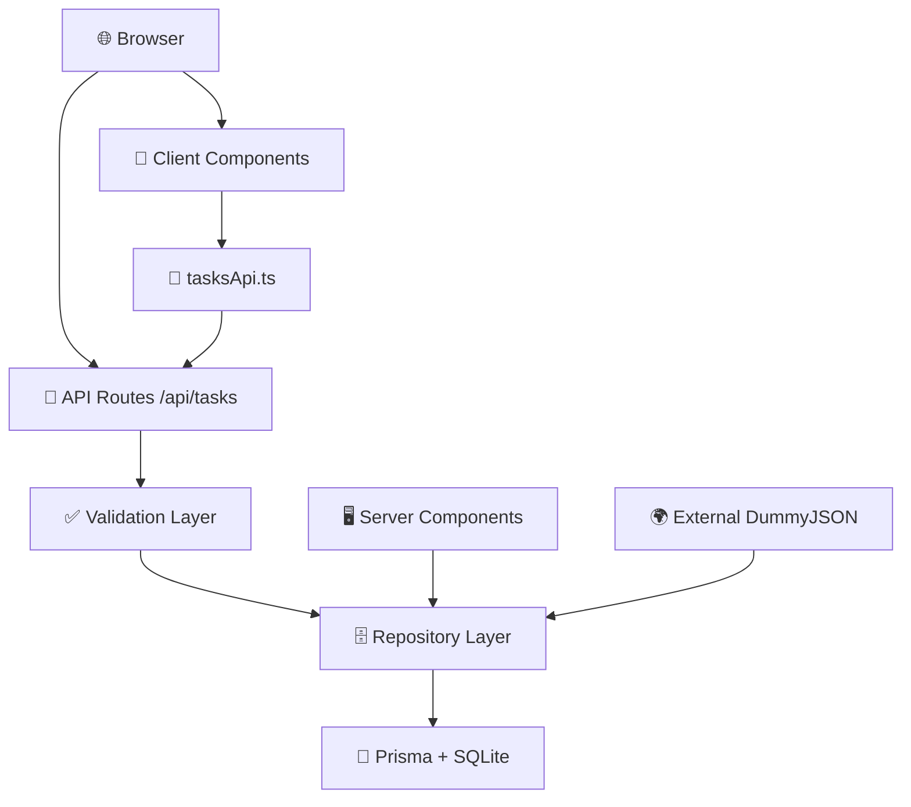

<div align="center">

# 📋 Task Management App

### ⚡ Next.js 15 + TypeScript + Prisma + Dark Theme

[](https://nextjs.org/)
[](https://www.typescriptlang.org/)
[](https://www.prisma.io/)
[](https://tailwindcss.com/)

**Modern task management application showcasing Next.js 15 App Router, Server Components, type-safe APIs, and clean architecture patterns.**

[🚀 Quick Start](#-local-development) • [📖 API Docs](#-api-reference) • [🏗️ Architecture](#-architecture-overview)

</div>

## 📑 Table of Contents

1. [✨ Features](#-features)
2. [🛠️ Tech Stack](#️-tech-stack)
3. [🏗️ Architecture Overview](#️-architecture-overview)
4. [📁 Project Structure](#-project-structure)
5. [🗃️ Data Model](#️-data-model)
6. [📖 API Reference](#-api-reference)
7. [✅ Validation Rules](#-validation-rules)
8. [🚀 Local Development](#-local-development)
9. [⚙️ Available Scripts](#️-available-scripts)
10. [🔧 Environment Variables](#-environment-variables)
11. [📝 Development Notes](#-development-notes--conventions)
12. [🔮 Future Improvements](#-future-improvements)

---

## ✨ Features

- 🎯 **Full CRUD Operations** - Create, read, update, delete tasks with real-time updates
- 🌙 **Dark Theme UI** - Beautiful dark interface with Tailwind CSS v4
- 📊 **Interactive Dashboard** - Statistics overview with task counts and recent activity
- 🗄️ **SQLite + Prisma** - Type-safe database with automatic seeding from [DummyJSON](https://dummyjson.com/todos)
- ⚡ **Server Components** - SSR-powered listing with optimized performance
- 🔄 **Client Components** - Interactive mutations with optimistic updates
- ✅ **Input Validation** - Robust server-side validation with structured error responses
- 🧩 **Modular UI** - Reusable components (button, card, modal, toast, loading states)
- 🚦 **Loading States** - Proper loading and error boundaries for all routes
- 🎨 **Progress Indicator** - Top-loading bar for navigation feedback
- 📱 **Responsive Design** - Works seamlessly across desktop and mobile devices

## 🛠️ Tech Stack

| Category            | Technology                                    | Version | Purpose                                              |
| ------------------- | --------------------------------------------- | ------- | ---------------------------------------------------- |
| **🚀 Framework**    | [Next.js](https://nextjs.org/)                | 15.x    | App Router, Server/Client Components, Route Handlers |
| **📝 Language**     | [TypeScript](https://www.typescriptlang.org/) | 5.x     | Type safety and developer experience                 |
| **⚛️ Runtime**      | [React](https://react.dev/)                   | 19.x    | UI library with latest concurrent features           |
| **🎨 Styling**      | [Tailwind CSS](https://tailwindcss.com/)      | v4      | Utility-first CSS framework                          |
| **🗄️ Database**     | [Prisma](https://www.prisma.io/) + SQLite     | 5.x     | Type-safe ORM with file-based database               |
| **🎯 Icons**        | [Lucide React](https://lucide.dev/)           | Latest  | Beautiful, customizable icons                        |
| **🔧 Utilities**    | `clsx` + `tailwind-merge`                     | Latest  | Conditional styling and class merging                |
| **✅ Validation**   | Custom validators                             | -       | Functional validation with sanitization              |
| **🌐 External API** | [DummyJSON](https://dummyjson.com/)           | -       | Initial data seeding service                         |

## 🏗️ Architecture Overview

The application follows a **clean layered architecture** with clear separation of concerns:



| 🏷️ Layer              | 📋 Responsibility                              | 📁 Key Files                               |
| --------------------- | ---------------------------------------------- | ------------------------------------------ |
| **🌐 API Routes**     | HTTP boundary, serialization, error mapping    | `app/api/tasks/*.ts`                       |
| **🗄️ Repository**     | Database access, seeding, domain mapping       | `app/tasks/repo.ts`                        |
| **🎯 Domain Types**   | Shared contracts and interfaces                | `types/*.ts`                               |
| **✅ Validation**     | Input sanitization and rule enforcement        | `lib/validation.ts`                        |
| **📡 Client API**     | Browser fetch abstraction with error handling  | `lib/tasksApi.ts`                          |
| **🧩 UI Components**  | Reusable presentational and interactive pieces | `components/`                              |
| **🏗️ Infrastructure** | Database client, external services             | `lib/prisma.ts`, `lib/dummyJsonService.ts` |

**🔄 Data Flow:**

- **Server Components** → Direct database access via repository
- **Client Components** → API routes via `tasksApi` wrapper → Repository → Database

## 📁 Project Structure

```
📦 nextjs-app/
├── 📂 app/                                 # Next.js App Router
│   ├── 📄 layout.tsx               # 🌙 Root layout (dark theme, sidebar, providers)
│   ├── 📄 page.tsx                 # 🔀 Landing page (redirects to dashboard)
│   ├── 📄 loading.tsx              # ⏳ Global loading fallback
│   ├── 📄 top-progress.tsx         # 📊 Progress bar component
│   ├── 📄 globals.css              # 🎨 Global styles (Tailwind base)
│   │
│   ├── 📂 api/tasks/               # 🔌 REST API endpoints
│   │   ├── 📄 route.ts             # POST /api/tasks (create task)
│   │   └── 📂 [id]/
│   │       └── 📄 route.ts         # GET/PUT/DELETE /api/tasks/:id
│   │
│   ├── 📂 dashboard/               # 📊 Dashboard route
│   │   ├── 📄 page.tsx             # Dashboard with stats & recent tasks
│   │   └── 📄 loading.tsx          # Dashboard loading state
│   │
│   ├── 📂 tasks/                   # 📋 Tasks management
│   │   ├── 📄 page.tsx             # Tasks listing (Server Component)
│   │   ├── 📄 loading.tsx          # Tasks loading state
│   │   ├── 📄 repo.ts              # 🗄️ Database repository with seeding
│   │   ├── 📂 components/
│   │   │   └── 📄 TaskListSSR.tsx  # Server-rendered task list
│   │   └── 📂 [id]/                # 📝 Individual task routes
│   │       ├── 📄 page.tsx         # Task detail page
│   │       ├── 📄 ClientActions.tsx # ⚡ Client-side actions
│   │       ├── 📄 loading.tsx      # Task detail loading
│   │       └── 📄 not-found.tsx    # 404 for invalid task IDs
│   │
│   └── 📂 hooks/                   # 🪝 Custom React hooks
│       └── 📄 useTaskOperations.ts # Task mutation hooks
│
├── 📂 components/                   # 🧩 Reusable UI components
│   ├── 📄 Sidebar.tsx              # 🧭 App navigation sidebar
│   ├── 📄 TaskCard.tsx             # 🎴 Task display card
│   ├── 📄 TaskForm.tsx             # 📝 Create/edit task form
│   ├── 📄 TaskList.tsx             # 📋 Interactive client task list
│   └── 📂 ui/                      # 🎨 UI primitives
│       ├── 📄 button.tsx           # 🔘 Button component
│       ├── 📄 card.tsx             # 🃏 Card container
│       ├── 📄 input.tsx            # ⌨️ Input fields
│       ├── 📄 modal.tsx            # 🪟 Modal dialogs
│       ├── 📄 toast.tsx            # 🍞 Toast notifications
│       └── 📄 loading-overlay.tsx  # ⏳ Loading overlay
│
├── 📂 lib/                         # 🔧 Utility libraries
│   ├── 📄 prisma.ts                # 🗄️ Prisma client singleton
│   ├── 📄 dummyJsonService.ts      # 🌐 External API integration
│   ├── 📄 tasksApi.ts              # 📡 Client-side API wrapper
│   ├── 📄 utils.ts                 # 🛠️ Generic utilities
│   └── 📄 validation.ts            # ✅ Input validation & sanitization
│
├── 📂 prisma/                      # 💾 Database schema & migrations
│   ├── 📄 schema.prisma            # 🏗️ Database schema definition
│   ├── 📂 migrations/              # 📈 Database migration history
│   └── 📂 prisma/
│       └── 📄 dev.db               # 🗃️ SQLite database file
│
├── 📂 types/                       # 📋 TypeScript type definitions
│   ├── 📄 task.ts                  # Task domain types & enums
│   ├── 📄 api.ts                   # API request/response contracts
│   └── 📄 dummyjson.ts             # External service types
│
├── 📂 public/                      # 🖼️ Static assets
│   └── 📄 *.svg                    # Icon files
│
└── ⚙️ Config files                 # Build & development configuration
    ├── 📄 package.json             # Dependencies & scripts
    ├── 📄 next.config.ts           # Next.js configuration
    ├── 📄 tsconfig.json            # TypeScript configuration
    ├── 📄 postcss.config.mjs       # PostCSS & Tailwind setup
    └── 📄 tailwind.config.js       # Tailwind CSS configuration
```

## 🗃️ Data Model

**Prisma Schema** (`prisma/schema.prisma`):

```prisma
model Task {
  id          String   @id @default(cuid())
  title       String
  description String
  status      String      // 'todo' | 'in-progress' | 'completed'
  priority    String      // 'low' | 'medium' | 'high'
  dueDate     DateTime?
  createdAt   DateTime @default(now())
  updatedAt   DateTime @updatedAt
}
```

**🔄 Data Transformations:**

- **Database** → Uses `DateTime` objects for timestamps
- **Domain** → Converts to ISO date strings for JSON serialization
- **Client** → Receives type-safe `Task` interface via API

**🌱 Automatic Seeding:**

- First database query triggers seeding from [DummyJSON API](https://dummyjson.com/todos)
- Converts external todo format to internal task structure
- Adds realistic random priorities, statuses, and due dates

## 📖 API Reference

**Base URL:** `/api/tasks` (Next.js App Router)

### 🆕 Create Task

```http
POST /api/tasks
Content-Type: application/json
```

**📤 Request Body:**

```json
{
  "title": "string (1-200 chars)",
  "description": "string (1-1000 chars)",
  "status": "todo | in-progress | completed",
  "priority": "low | medium | high",
  "dueDate": "2025-01-15T00:00:00Z" // Optional ISO string
}
```

**✅ Success Response (201):**

```json
{
  "success": true,
  "data": {
    "id": "cm1xyz...",
    "title": "Complete project",
    "description": "Finish the task management app",
    "status": "todo",
    "priority": "high",
    "dueDate": "2025-01-15T00:00:00.000Z",
    "createdAt": "2025-09-19T10:30:00.000Z",
    "updatedAt": "2025-09-19T10:30:00.000Z"
  },
  "message": "Task created successfully"
}
```

### 📖 Get Task

```http
GET /api/tasks/:id
```

**✅ Success (200):** Returns task object
**❌ Errors:** `404 TASK_NOT_FOUND`, `400 INVALID_TASK_ID`

### ✏️ Update Task

```http
PUT /api/tasks/:id
Content-Type: application/json
```

**📤 Request Body (partial update):**

```json
{
  "title": "Updated title", // Optional
  "status": "completed", // Optional
  "dueDate": null // Optional (null clears date)
}
```

### 🗑️ Delete Task

```http
DELETE /api/tasks/:id
```

**✅ Success:** `{ "success": true, "data": { "id": "..." } }`

### ❌ Error Response Format

```json
{
  "success": false,
  "error": "Human readable message",
  "code": "VALIDATION_ERROR | INTERNAL_ERROR | TASK_NOT_FOUND | ...",
  "errors": [{ "field": "title", "message": "Title is required" }]
}
```

## ✅ Validation Rules

| 🏷️ Field           | 📋 Rules                                                 |
| ------------------ | -------------------------------------------------------- |
| **📝 title**       | Required for creation • 1-200 characters • Auto-trimmed  |
| **📄 description** | Required for creation • 1-1000 characters • Auto-trimmed |
| **🎯 status**      | Must be one of: `todo`, `in-progress`, `completed`       |
| **⚡ priority**    | Must be one of: `low`, `medium`, `high`                  |
| **📅 dueDate**     | Optional ISO date string • Can be `null` to clear        |

**📝 Update Rules:**

- ✅ Partial updates allowed (send only changed fields)
- ❌ At least one field required for updates
- 🧹 All text fields are automatically trimmed and sanitized

## 🚀 Local Development

### 📋 Prerequisites

- **Node.js** 18+ (Next.js 15 requirement)
- **Package Manager:** npm, pnpm, yarn, or bun
- **Database:** None required! Uses SQLite file database

### ⚡ Quick Start

1️⃣ **Install dependencies:**

```bash
npm install
```

2️⃣ **Generate Prisma client:**

```bash
npm run prisma:generate
```

3️⃣ **Start development server:**

```bash
npm run dev
```

4️⃣ **Open your browser:**

```
🌐 http://localhost:3000
```

**🎉 That's it!** The app will automatically:

- 🗄️ Create the SQLite database on first run
- 🌱 Seed with sample tasks from DummyJSON API
- 🔄 Enable hot reload with Turbopack

### 🗃️ Database Management

**Reset database (Windows PowerShell safe):**

```bash
npm run db:reset
```

**Create new migration:**

```bash
npm run prisma:migrate
```

## ⚙️ Available Scripts

| 🎯 Command                | 📋 Description                                            |
| ------------------------- | --------------------------------------------------------- |
| `npm run dev`             | 🚀 Start development server with **Turbopack**            |
| `npm run build`           | 📦 Create production build                                |
| `npm run start`           | 🌐 Run production server                                  |
| `npm run prisma:generate` | 🔧 Generate Prisma client from schema                     |
| `npm run prisma:migrate`  | 📈 Create and apply database migration                    |
| `npm run db:reset`        | 🔄 Reset database and rerun migrations (safe for Windows) |

**💡 Pro Tips:**

- Use `dev` for development (includes hot reload + Turbopack)
- Run `prisma:generate` after schema changes
- Use `db:reset` for clean development state

## 🔧 Environment Variables

Create a `.env` file in the project root:

```env
# 🗄️ Database Configuration
DATABASE_URL="file:./prisma/dev.db"

```

**📝 Notes:**

- 🔄 Adjust `DATABASE_URL` path if relocating the database file
- 🔒 No sensitive credentials needed for local development

## 📝 Development Notes & Conventions

### 🏗️ Architecture Principles

- **🖥️ Server Components** for data fetching (no client JavaScript bundle)
- **⚡ Client Components** for interactivity (`tasksApi` wrapper for mutations)
- **✅ Server-side validation** with client error surfacing (DRY principle)
- **🗄️ Repository pattern** owns seeding, mapping, and database logic
- **🚫 Direct Prisma imports** avoided in UI components (use repository functions)

### 🎨 UI/UX Patterns

- **🌙 Dark theme** with consistent color palette
- **⏳ Loading states** for all async operations
- **🍞 Toast notifications** for user feedback
- **📱 Responsive design** with mobile-first approach
- **🎯 Semantic TypeScript interfaces** prevent DB leakage

### 🔄 Data Flow Best Practices

- Server Components → Repository → Database
- Client Components → API Routes → Repository → Database
- Type safety enforced at all boundaries

---

<div align="center">

**Made with ❤️ using Next.js 15 & Prisma**

[](https://github.com/FilipWjk/next-js-app)

</div>
